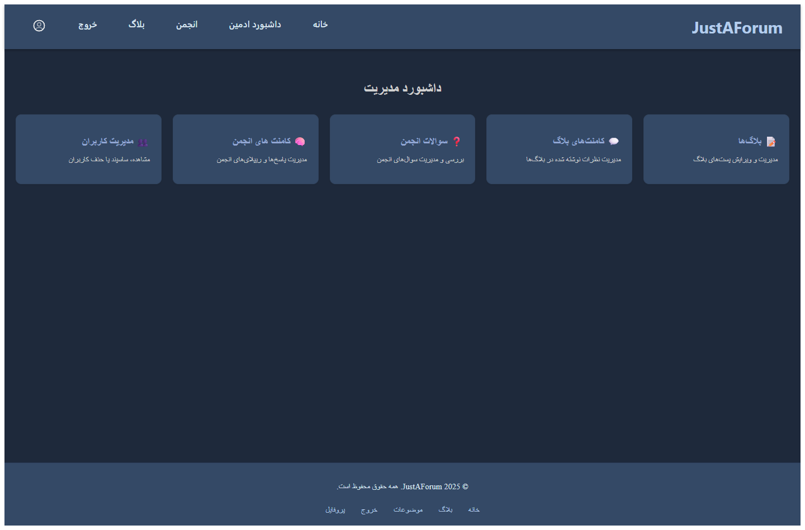
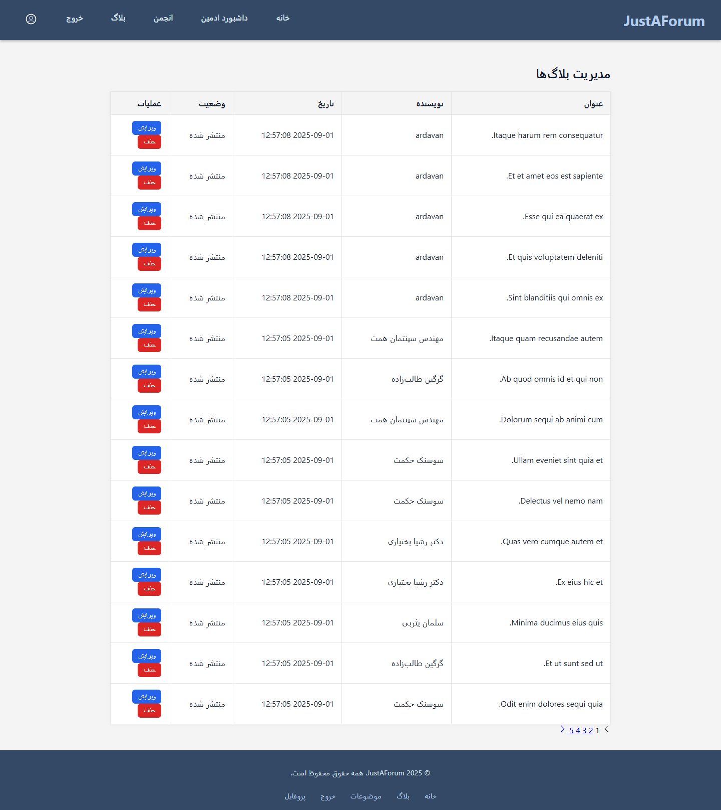
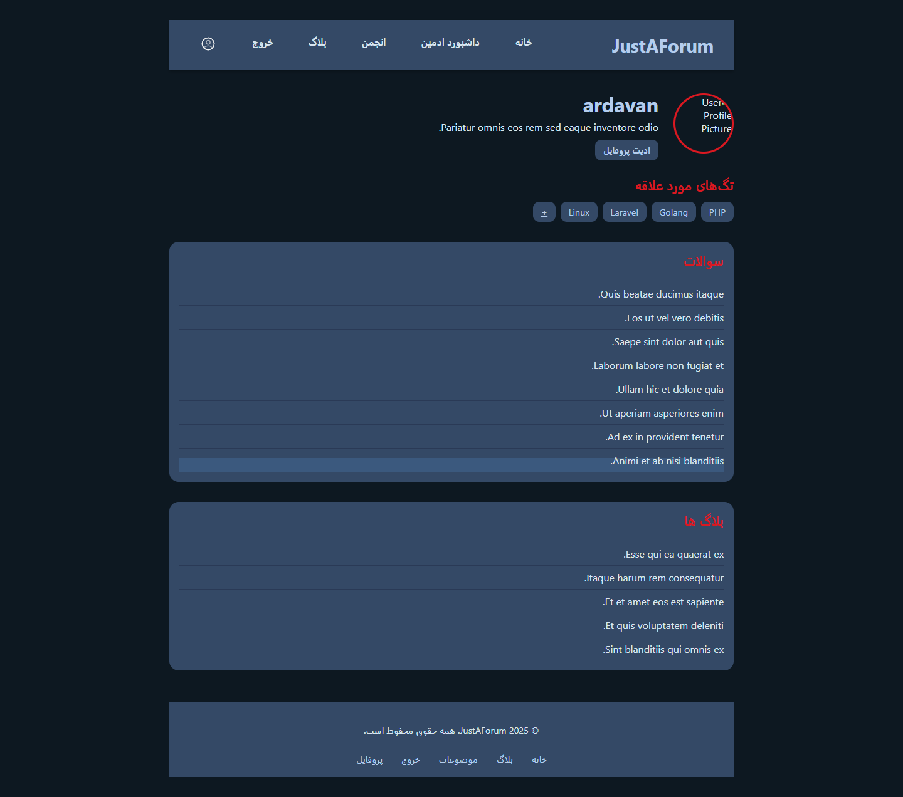

# justAForum

A simple yet feature-rich forum and blog web application built with Laravel.

> 🧩 My first complete web project that combines a Q&A forum and a blog system under one app.


The website’s front-end is very simple and a bit problematic because it was designed by AI.


### Features


- ❔[Forum](#-forum): Choose a topic and ask or answer a question.
- 📘[Blog](#-blog): View,write and update blogs.
- 👤[Admin Dashboard](#-admin-dashboard): Manage users and contents shared on the application.
- 👥[Profile](#-profile): manage your credentials, blogs, forum questions and favorite tags.

---

## 🧰 Tech Stack

- **Backend:** Laravel 11, PHP 8.x
- **Frontend:** Blade, TailwindCSS (or Bootstrap if used)
- **Database:** MySQL
- **Authentication:** Laravel Sanctum
- **Tools:** Composer, NPM, Git

---

#### ❔Forum

A section where you can choose a topic, and related questions about that topic are displayed.

- Create a question (under a topic)
- Edit a question
- Comment to answer questions  
....- A comment can be approved as an answer and displayed differently  
....- Like comments


---

#### 📘Blog

Blogs are not categorized, but each one can have its own tags.


- Create a blog
- Edit a blog
- Comment  
....- Reply to comments  
....- Like comments and replies


---

#### 👤Admin Dashboard

Through the admin dashboard, you can manage most of the content and users.



- Restrict or unrestrict users  
- Delete or edit blogs  
- Delete or edit forum questions  
- Delete comments from blogs and forum questions




---

#### 👥Profile

Each user’s profile page shows their activity and interests.



- Includes user’s favorite tags, questions, and blogs  
- Add or remove tags  
- Edit user information


---

## 🚀 Installation & Setup

1. Clone the repository:
   ```bash
   git clone https://github.com/yourusername/justAForum.git
   cd justAForum

2. Install dependencies:
    ```bash
    composer install
    npm install && npm run dev

3. Create **.env** file and configure your database:
   ```bash
    cp .env.example .env
    php artisan key:generate

4. Run migration and seeders:
    ```bash
    php artisan migrate --seed

5. Start the development server:
    ```bash
    php artisan serve
    
---

### Future Updates

Because the website is large and feature-rich, and due to limited time, many features are incomplete or missing. Some planned updates include:

- Add loggers  
- Add sanitizers  
- Add the ability to view other users’ profiles  
- Enable image upload and display in different sections  
- Prevent activity for restricted users  
- Suspend any comment, blog, etc., containing inappropriate words  
- Add tags to each blog  
- Allow users to delete their own blogs, questions, or comments
